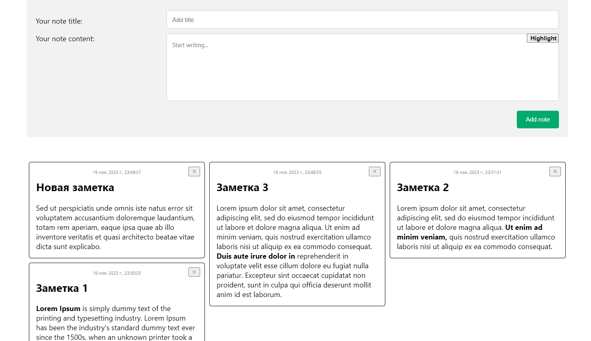

# NotesInAHurry
NotesInAHurry is a simple module provides form, from with user can add notes

## About

The user can create and see notes. Notes have a title,
date and content. Some of the content can be highlighted in bold. After creation,
the notes go into the list below the form. Notes can be deleted from the list using the delete button at the top of the note. The list of notes is made in the form of a masonry layout.

## Installation

```
$ npm i notesinahurry
```

## Usage

Import the component
```
import { NotesInAHurry } from 'notesinahurry';
```
use as a regular component


## Module appearance


